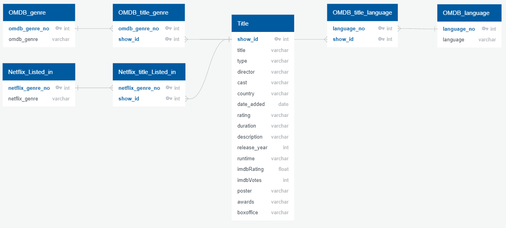

# Netflix_Search

## Proposal

We are providing the user a way to search netflix shows and movies by genre and rating to find something to watch on Netflix. We will be using two datasets. We are using a Netflix Movies and TV Shows csv file from Kaggle and using the OMBD API and storing the data in postgreSQL.

>- Extract - We will be using two datasets. We are using a Netflix Movies and TV Shows csv file from Kaggle and using the OMDB API (OMDBAPI.com).
>- Transform -  We will pull from the OMDB API titles, ratings, genres, etc. and using the csv netflix file, denoting if the title is in Netflix.
>- Load - We will create the database in postgreSQL

## Team Members
>- Mary Mays - Responsibility: API pull jupyter notebook
>- Melanie Nolker - Responsibility: Database schema and SQL loading
>- Lisa Stroh - Responsibility: Data transform and load jupyter notebook

## Data Sources
>- The two data sources were a csv file netflix movies and tv shows from Kaggle: https://www.kaggle.com/shivamb/netflix-shows and the OMDB API http://www.omdbapi.com/

## Data Cleanup and Analysis

### Extract
>- From the OMDB source we cleaned the "NA" string to blank
>- If it wasn't a Movie, the API didn't have a boxoffice field. We had to create an if statement in the code to account for that
>- Each API key only allowed 1000 pulls per day and we had over 6000 pulls. We had to manage multiple API keys in a list and loop through to not exceed 1000 per key. 

### Transform
>- The API pull jupyter notebook exported a CSV. The Transform_Load.ipynb pulled the two CSV files and then merged them. We dropped some columns that were not a one-to-one to the title and created separate tables for those with a junction table.
>- The data was pulled into a dataframe from the CSVs with pandas. Pandas did not recognize the comma delimited strings as a list. We had to use the str.split(',').tolist() function for the "genre", "listed_in", and "language" columns. We did not do this for the "country", "director", and "cast" columns since we were not splitting them into extra tables. 
>>- We removed the NaN values before looping through the "genre", "listed_in" and "language" columns. We looped through to get the unique values into a set. A set was used since we wanted unique values only in the list for each category and we did not need them in a certain order.
>- We then did the .explode() to be able to break out the show_id into a row per genre/listed_in or language.
>- The tables were merged to get a show_id and genre/listed_in/language id table as the junction tables.

### Load
>- The database schema is shown below in the image. We used the main merged "Title" table and then had a OMDB_genre and netflix_genre table along with their junction tables. 

>- The database and tables were initially set up in PostgreSQL, a relational database, since our data was consistent and so we were able to relate tables to make it easier to query.
>- The Transform_Load.ipynb file loads the table data into the tables in PostgreSQL.

